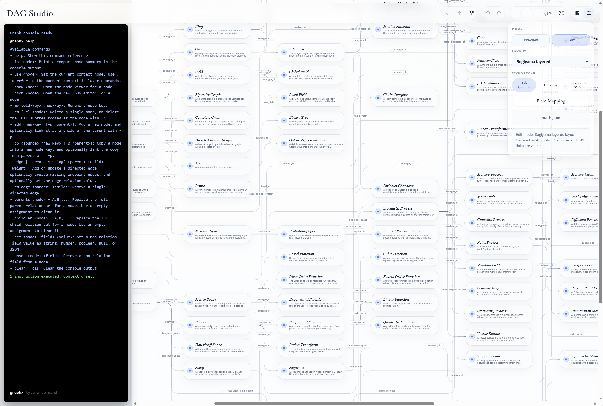

# Graph Studio

Graph Studio is a browser-based graph viewer and lightweight JSON editor for directed graphs and Sankey diagrams.

It is built for fast graph inspection and editing in the browser:

- load a JSON graph and render it immediately
- validate versioned graph documents and resolve multi-file conflicts before importing
- navigate by root, subtree, or parent level
- edit nodes and relationships directly in the UI
- batch graph edits from a text console in `Edit` mode
- undo and redo graph mutations without losing navigation history
- save the updated graph back to JSON or export the current view as SVG



## Quick Start

### One-click startup (Windows / macOS)

- **Windows:** double-click `start.bat`, or run it from any directory. It uses the shared [`../scripts/node-runtime.ps1`](../scripts/node-runtime.ps1) to find Node.js 22.12+ and npm or pnpm, including an existing Codex runtime. If none is available, install Node.js LTS (including npm) from https://nodejs.org/. Keep this project alongside the repository's `scripts` directory.
- **macOS:** install Node.js LTS (including npm), run `chmod +x start.command` once in the project directory, then double-click `start.command`. You can also run `bash start.command` in Terminal.

The scripts switch to the project directory, install dependencies, and open the app in your browser. The server listens on `127.0.0.1` only. Keep the terminal window open; press `Ctrl+C` to stop. The first launch requires internet access. Do not copy `node_modules` between Windows and macOS.

On Windows, npm is preferred; when npm is missing, the launcher imports `package-lock.json` into a local pnpm lockfile and installs with pnpm. Successful installations are cached and rechecked on each launch; dependency changes or incomplete installations trigger a reinstall. The generated `pnpm-lock.yaml` is ignored by Git; `package-lock.json` remains authoritative. On macOS, run `npm ci` again after pulling dependency changes.

Windows startup options:

```powershell
.\start.bat -InstallOnly  # Prepare dependencies without starting the server
.\start.bat -BuildOnly    # Check TypeScript and build the app
.\start.bat -NoBrowser    # Start without opening a browser
```

### Manual startup

```powershell
npm install
npm run dev
```

Then open the local dev server URL shown by Vite.

Useful commands:

```powershell
npm run build
npm test
```

The app starts on a welcome page. Open a graph file, open a folder as a workspace, reopen a recent location, or explore one of three independent example workspaces:

- **Mathematics:** 112 concepts, eight subject views, and linked English notes adapted from `math/studio`.
- **Factorio production:** two demand-driven Space Age 2.0.65 Sankey plans: one complete launch-ready rocket per second, or all 12 science packs simultaneously at one of each per second. Both trace production back to raw resources.
- **Energy flows:** a compact, balanced Sankey example with eight nodes and nine flows.

Examples open fresh editable copies and can be reopened from Recents without folder permissions. The canvas fills the window, with the `math/studio` glass toolbar and workspace panels floating above it. Fit uses the area visible beside the panels; panning can move the graph beneath them.

Factorio values are calculated per-second material flows, including batch yields, built-in machine productivity, biological fuel, credited coproducts and catalyst/coolant returns. Surplus output is explicit. These aggregate material plans exclude power, heating, transport, spoilage in transit, construction and launch scheduling. See [Example workspaces](docs/examples.md) for sources, assumptions and regeneration.

Graph documents use the strict Graph Studio v2 envelope: `format`, `version`, `nodes`, and `edges`. Custom document and edge fields live in `metadata`; node fields retain arbitrary JSON values. Legacy formats and field aliases are rejected.

## What You Can Do

- inspect and edit v2 graphs directly
- initialize a blank canvas with one starter node
- focus a node, move back through focus history, or move up to parent levels
- work with multiple roots as a forest
- switch chart type between `Node-link` and `Sankey`, each with its own saved appearance
- arrange Node-link charts with `BFS`, `Sugiyama` or `Dagre`; Sankey uses automatic flow layout
- configure node shadows in Appearance settings, with live preview and SVG export
- visualize numeric flows using the optional v2 `diagram: "sankey"` protocol ([example](public/sankey-example.json))
- inspect every node field in a generic node viewer
- edit relationships, rename nodes, duplicate nodes, or delete a node or subtree
- use the graph console for batch edits with undoable transactions
- save over the original JSON when file access is available, or download a new copy

## Documentation

- [Documentation Index](docs/index.md): overview of the available project docs
- [Workspace Guide](docs/workspaces.md): opening modes, recent locations, discovery manifest, and local links
- [Usage Guide](docs/usage.md): UI workflows, navigation, editing, saving, and layouts
- [Data Format Guide](docs/data-format.md): v2 document contract, metadata, validation, and import conflict strategies
- [Graph Console DSL](docs/graph-console-dsl.md): command reference for the edit-mode console
- [Development Guide](docs/development.md): local scripts, source layout, and implementation notes

## Minimal Example

```json
{
  "format": "graph-studio",
  "version": 2,
  "nodes": {
    "A": { "title": "Root", "type": "Concept" },
    "B": { "title": "Child", "type": "Theorem" }
  },
  "edges": [
    { "id": "edge-ab", "source": "A", "target": "B", "value": "supports" }
  ]
}
```

For the recommended data model and additional examples, see [Data Format Guide](docs/data-format.md).

## Project Structure

- [`src/`](src/): React app source
- [`public/example.json`](public/example.json): sample graph data
- [`docs/`](docs/): user and developer documentation
- [`src/styles/`](src/styles/): split global styles (tokens, layout, controls, graph, console, modals)

## License

MIT License. See [LICENSE](LICENSE) for details.
