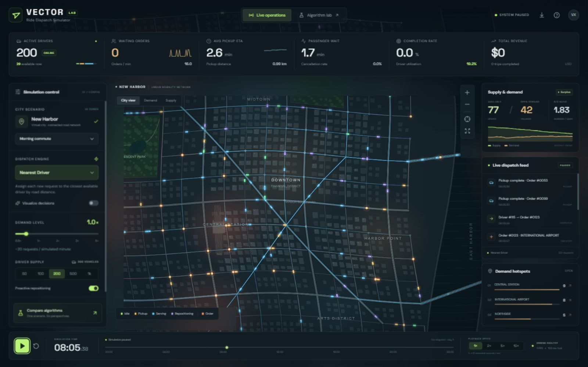

# VECTOR — Ride Dispatch Simulator

A fully English, interactive ride-hailing dispatch laboratory built around a full-screen synthetic city. Vehicles travel on a connected road graph, passengers generate real requests, six dispatch policies make actual assignments, and the dashboard reports outcomes from the running simulation. It runs locally without a map API key or paid service.



[Algorithm comparison preview](docs/benchmark.png)

## Run locally

Install **Node.js 22 or newer**, with npm available on `PATH`.

On Windows, double-click **`launch.cmd`**. The standalone launcher installs missing project dependencies, starts Vite, and opens [the simulator](http://127.0.0.1:4186/). Keep its terminal open while using the application. Press `Ctrl+C` to stop the server.

From a terminal in this directory:

```powershell
npm install
npm run dev
```

The development server uses **http://127.0.0.1:4186/**. Its strict port setting reports an error if that port is already in use.

```powershell
npm run build    # Type-check and build into dist/
npm test         # Routing, matching, lifecycle, determinism, and benchmark tests
npm run preview # Serve an existing production build on port 4186
```

The PowerShell launcher also supports:

```powershell
.\launch.ps1 -BuildOnly             # Install missing dependencies and build
.\launch.ps1 -Preview               # Build, serve production files, open browser
.\launch.ps1 -NoBrowser             # Run development server without opening a tab
.\launch.ps1 -Preview -NoBrowser    # Build and preview without opening a tab
.\launch.ps1 -InstallOnly           # Install dependencies and exit
```

If your PowerShell policy blocks direct script execution, use `launch.cmd` with the same flags. `-BuildOnly`, `-Preview`, and `-InstallOnly` are mutually exclusive. The launcher is independent of any scripts in the parent `tools` directory.

## Explore the city

The default scenario starts **paused at 08:00**, with **200 drivers**, **30 initial requests**, **10 demand zones**, and **Nearest Driver** dispatch. Press Play to begin. At demand 1×, a Poisson arrival process averages **20 new requests per simulated minute**.

- Drag the map to pan, scroll to zoom, and use the map reset control to restore the city view.
- Click a driver, passenger, or district label to inspect it. Hotspot rows focus their districts.
- Switch between City, Demand, and Supply views; independently toggle drivers, orders, heatmaps, roads, routes, districts, and dispatch lines.
- Enable algorithm visualization to inspect candidate matches and selected assignments.
- Adjust fleet size, demand multiplier, algorithm, batch interval, and score weights while running. Existing trips continue when the dispatch algorithm changes.
- Play, pause, reset, and select 1×/2×/5×/10× playback. **1× playback advances 10 simulated seconds per real second.**
- Moving the hour slider **restarts the seeded scenario at that hour**. It is a scenario selector, not a rewind control.

Keyboard shortcuts work when focus is outside form controls:

| Key     | Action                           |
| ------- | -------------------------------- |
| `Space` | Play or pause                    |
| `R`     | Reset the current scenario       |
| `Esc`   | Close the active panel or dialog |

## Dispatch experiments

| Policy         | Actual matching behavior                                                                                             |
| -------------- | -------------------------------------------------------------------------------------------------------------------- |
| Nearest Driver | Process oldest requests, choosing the nearest available driver by road distance.                                     |
| FIFO           | Pair oldest requests with the longest-idle drivers.                                                                  |
| Global Greedy  | Repeatedly select the lowest-cost available driver/request pair across the entire matrix.                            |
| Hungarian      | Solve exact rectangular minimum-cost assignment over the current road-distance matrix.                               |
| Batch Matching | Wait 3, 5, or 10 simulated seconds, then solve Hungarian assignment for the accumulated requests.                    |
| Score Based    | Combine normalized pickup distance, rider wait, driver idle time, local supply/demand pressure, and income fairness. |

The Algorithm Lab runs each policy in a Web Worker, replaying the **same seed, initial fleet, future arrivals, origins, and destinations**. It compares pickup ETA, passenger wait, pickup distance, completion rate, utilization, income variance, and cancellation rate. Results can be exported from the lab. The live scenario continues independently.

The model's default seed is `71429`. Change `SimulationConfig.seed` when constructing or resetting an engine to run another reproducible experiment. The benchmark receives an explicit seed and model settings; every policy within a benchmark receives identical inputs. Demand uses a separate random stream, so assignment decisions cannot alter future passenger requests.

## What the metrics mean

- **Active drivers:** all online drivers, including drivers going to a pickup or carrying a passenger.
- **Supply / demand:** available Idle/Repositioning drivers versus passengers not yet picked up. S/D is supply divided by demand, using a denominator of at least one.
- **Orders/min:** actual arrivals during the previous 60 simulated seconds, including the initial 30-request burst at startup.
- **Pickup ETA / distance:** average predicted pickup duration and road distance at assignment time.
- **Passenger wait:** average actual wait of picked-up passengers; until the first pickup, the average wait of current unpicked passengers.
- **Completion / cancellation:** completed or cancelled requests divided by all requests created since reset.
- **Utilization:** accumulated passenger-carrying driver time divided by total online driver time.
- **Revenue:** fares from completed trips, in illustrative USD. Income variance is population variance in USD squared across driver records.

A finite benchmark can finish while trips are still active, so completion and cancellation rates do not necessarily add up to 100%. Metrics are calculated from the simulation; charts do not use fabricated performance results.

## Architecture

The application uses **React, TypeScript, Vite, and Canvas**. The city is generated locally, so no external tiles or geocoding services are required.

```text
src/
  App.tsx                  Floating controls, inspectors, timeline, and dialogs
  types.ts                 Shared model contracts and algorithm catalog
  components/              Canvas map and reusable UI components
  engine/
    city.ts                Connected streets, districts, buildings, parks, river
    routing.ts             Cached shortest paths and continuous route changes
    dispatch.ts            Pure assignment policies and rectangular Hungarian solver
    simulation.ts          Clock, demand, vehicle/order lifecycle, and live metrics
    benchmark.ts           Deterministic replay across all dispatch policies
    benchmark.worker.ts    Background benchmark execution
    README.md              Detailed engine API, units, and model conventions
tests/                     Meaningful algorithm and simulation regression tests
```

The engine mutates its own state independently of React. The map renders using `requestAnimationFrame`; the dashboard samples state at a lower frequency. Vehicle motion follows road segments, including when a new assignment arrives during an existing movement. Shortest-path caches are shared by simulations using the same city. The benchmark worker keeps comparative experiments off the main UI thread.

For extension points, exact state units, routing behavior, retention limits, and lifecycle details, read the [engine documentation](src/engine/README.md). New policies belong in `dispatch.ts` and the algorithm catalog in `types.ts`; lifecycle mutations remain the engine's responsibility.

## Model assumptions

This is a synthetic research and demonstration environment, not a real-world operational dispatch service. Roads are bidirectional, with class-specific speeds and a commute-hour speed adjustment. Demand locations change with time of day: residential-to-CBD commuting in the morning, the reverse in the evening, nightlife departures at night, and sustained airport demand. Total baseline arrival intensity remains 20/min multiplied by the demand setting.

Passengers cancel after ten simulated minutes without pickup. Fares use a transparent illustrative distance/time formula. Available drivers cruise streets; optional rebalancing moves a bounded share toward demand hotspots. When fleet supply decreases, busy drivers finish their trips before going offline.

The model does not include traffic lights, congestion feedback, one-way restrictions, real geographic data, pooled rides, stochastic driver acceptance, or production pricing. Events, history, candidate lines, and terminal order details have bounded retention, while lifetime metrics remain cumulative. The engine supports 1,000 drivers and more than 100 simultaneous requests; rendering performance depends on the browser, device, layers, and playback speed.
