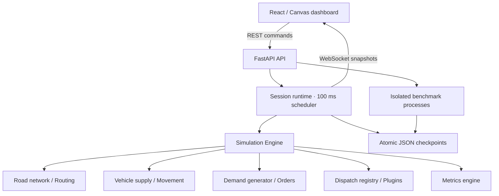

# VECTOR — Ride Dispatch Simulation Platform

An English-language urban mobility platform with a **Python/FastAPI simulation backend** and an independent **React/TypeScript frontend**. The city runs on the server even when no browser is connected. REST endpoints control simulations; WebSockets stream authoritative state. There is no browser simulation fallback.

## Run on Windows

Double-click **[launch.cmd](launch.cmd)**. The launcher prepares separate dependencies, starts the API on port **8000**, starts the UI on port **4186**, and opens the application. Python **3.11+** and Node.js **22+** are required. An available bundled Codex Python runtime is also supported.

- Application: [http://127.0.0.1:4186](http://127.0.0.1:4186/)
- Interactive API documentation: [http://127.0.0.1:8000/docs](http://127.0.0.1:8000/docs)
- Health: [http://127.0.0.1:8000/health](http://127.0.0.1:8000/health)

```powershell
.\launch.cmd -InstallOnly
.\launch.cmd -BuildOnly
.\launch.cmd -NoBrowser
.\launch.cmd -Preview
.\launch.cmd -BackendOnly
.\launch.cmd -FrontendOnly
```

The launcher starts its backend helper without an additional console window. Backend logs are in `.runtime/`. When the frontend exits, the launcher stops only the backend process it started; an existing backend is reused. Simulation checkpoints remain in `backend/var/`.

## Run each service independently

Backend, from `backend/`:

```powershell
python -m venv .venv
.\.venv\Scripts\python.exe -m pip install -r requirements.txt
.\.venv\Scripts\python.exe -m uvicorn app.main:app --host 127.0.0.1 --port 8000 --workers 1
```

Frontend, in another terminal from `frontend/`:

```powershell
npm ci
npm run dev
```

On macOS/Linux, use `python3`, `.venv/bin/python`, or `bash scripts/dev.sh` from the project root. The shell helper installs dependencies and runs both services. Keep one application worker: a session has a single authoritative owner. Scaling across API processes requires an external session coordinator and state store.

Vite proxies `/api`, `/ws`, and `/health` to the backend. `VITE_API_BASE` can point the frontend at a separately hosted API. For cross-origin hosting, configure `VECTOR_ALLOWED_ORIGINS` on the backend with the exact frontend origin. Avoid a trailing `/api` in the API base URL.

## Docker

```sh
docker compose up --build
```

The frontend is built and served by Nginx, which proxies HTTP and WebSocket requests to FastAPI. Both host ports bind to loopback. The `simulation-data` volume stores checkpoints and benchmark records. The Docker configuration is provided for deployment; Docker was not available in the development environment for an end-to-end container run.

## Ownership and data flow



| Component | Responsibility |
| --- | --- |
| Frontend | Map rendering, road-constrained visual interpolation, controls, charts, inspectors, connection state |
| API | Validated commands, simulation sessions, history queries, exports, benchmark jobs |
| Session runtime | Server-owned clock, serialized mutation, streaming, checkpoints |
| Simulation engine | Vehicle/order lifecycles, demand arrival, dispatch scheduling, accumulated results |
| Routing | Dijkstra routes, physical road distance and travel time, unfinished-edge handling |
| Dispatch registry | Interchangeable algorithms selected by ID; no algorithm branches in the engine |
| Benchmark workers | Identical seeded replays outside the API event loop, progress streaming, cancellation |

The frontend does **not** generate orders, advance the city clock, update vehicle business state, find routes, match drivers, or compute operational KPIs. District statistics and heatmap weights come from the backend. Canvas interpolation only animates the segments that the server already reports; it does not invent trips or change authoritative state.

## Simulation

The default session starts paused at **08:00**, with **200 drivers**, **30 initial requests**, **10 demand zones**, and **Nearest Driver**. New requests arrive through a spatially weighted Poisson process averaging **20/min × demand multiplier**.

- Driver supply: 50, 100, 200, 500, or 1,000.
- Initial supply distribution: Uniform, Demand Weighted, or Random Cluster. A change applies to newly added drivers and the next scenario initialization.
- Morning origins favor residential districts and CBD destinations; evenings reverse the commute; late nights favor entertainment origins; airports sustain demand.
- Orders progress through waiting, assignment, pickup, service, and completion. Unpicked passengers cancel after ten simulated minutes.
- Drivers complete existing road segments before taking new routes. Reducing supply retires available drivers immediately and busy drivers after their trip.
- Idle drivers cruise; optional repositioning moves supply toward district demand.
- The synthetic city includes arterial, secondary and local roads, diagonal avenues, parks, a river, bridges, and an airport district. Static geometry is served by the backend, without tile services or API keys.

The scheduler wakes every **100 ms of real time**. `simulationSpeed` (1/2/5/10) multiplies `secondsPerRealSecond` (default **10**). Elapsed real time is measured on the server; changing speed does not change the scheduler interval. Physics integrates bounded simulated-time steps. No frontend timer controls the simulation.

Pause freezes the server clock. Reset recreates the seed and settings. Selecting a different city hour restarts that scenario rather than pretending to rewind its history. Closing the browser disconnects visualization; an already-running backend session continues.

## Dispatch algorithms

| Plugin ID | Policy |
| --- | --- |
| `nearest` | Nearest driver by road pickup distance, prioritizing older requests |
| `fifo` | Oldest requests paired with longest-idle eligible drivers |
| `greedy` | Repeatedly select the lowest-cost available driver/order pair |
| `hungarian` | SciPy rectangular optimal assignment; default objective is total pickup ETA |
| `batch` | Pool requests for 3, 5, or 10 simulated seconds, then optimize matching |
| `score` | Weighted pickup ETA, rider wait, driver idle time, district scarcity, and income fairness |

All policies implement the common `DispatchAlgorithm` interface in `backend/app/dispatch/base.py`. Register a plugin instance in the shared `backend/app/dispatch/plugins.py` bootstrap so both the API and spawned benchmark processes load it. The API algorithm catalog and frontend selector then discover it by ID. Implement batch timing through the plugin's dispatch interval method; the simulation engine requires no policy-specific edit. The [architecture and extension guide](docs/architecture.md) provides model definitions, metric semantics and a complete plugin example.

## Algorithm Lab

The UI submits a backend benchmark job and receives progress over `/ws/benchmarks/{id}`. Every registered policy starts from the same seed, driver distribution, initial requests, future arrival sequence, and OD pattern. Separate demand and supply random streams keep assignments from changing subsequent requests.

Benchmarks run in separate processes, not Web Workers or the API event loop. They support cancellation, result retrieval, and CSV export with scenario parameters. Comparison metrics include pickup ETA, passenger wait, pickup distance, completion, utilization, income variance, and cancellation. Results include the initial warm-up and trips still active at the horizon.

## API

| Method | Endpoint | Purpose |
| --- | --- | --- |
| GET | `/api/algorithms` | Registered algorithm metadata |
| POST / GET | `/api/simulations` | Create or list sessions |
| GET / DELETE | `/api/simulations/{id}` | Read or delete a session |
| POST | `/api/simulations/{id}/start` | Start server-side simulation |
| POST | `/api/simulations/{id}/pause` | Pause |
| POST | `/api/simulations/{id}/reset` | Reset with optional configuration |
| PATCH | `/api/simulations/{id}/config` | Change parameters or algorithm |
| POST | `/api/simulations/{id}/time` | Restart at a different hour |
| GET | `/api/simulations/{id}/metrics` | Historical metrics |
| GET | `/api/simulations/{id}/snapshot` | Authoritative snapshot export |
| POST | `/api/benchmarks` | Create benchmark job |
| GET / DELETE | `/api/benchmarks/{id}` | Results or job cancellation |
| GET | `/api/benchmarks/{id}/csv` | CSV export |
| WS | `/ws/simulation/{id}` | Authoritative clock, drivers, orders, matches, metrics, districts, feed |
| WS | `/ws/benchmarks/{id}` | Benchmark progress and results |

Example without the frontend:

```powershell
$session = Invoke-RestMethod -Method Post -Uri http://127.0.0.1:8000/api/simulations -ContentType application/json -Body '{"config":{"supply":200,"algorithm":"hungarian"}}'
Invoke-RestMethod -Method Post -Uri "http://127.0.0.1:8000/api/simulations/$($session.simulationId)/start"
Invoke-RestMethod -Uri "http://127.0.0.1:8000/api/simulations/$($session.simulationId)"
```

The first simulation WebSocket message is a complete `snapshot`. Within each connection, subsequent `state` frames carry increasing sequence numbers. A fresh connection's initial snapshot establishes the current server baseline, including after checkpoint recovery. Static map geometry is fetched once via REST. Queues retain the latest frame for slow subscribers; clients reconnect with backoff and discard stale frames. Missing records return 404 and invalid commands return 422. There is no high-frequency frontend REST polling.

## Persistence

`VECTOR_DATA_DIR` controls the backend data directory (default `backend/var/`). The server writes atomic checkpoints every five seconds and saves command changes. Engine state, random streams, clocks and aggregate counters are preserved. An abrupt stop can lose progress since the latest checkpoint. Recovered simulations load **paused**. Benchmark records and results also persist. This is a single-node JSON data store, with clear replacement points for Redis/PostgreSQL. The UI's snapshot export is a reporting document containing state, configuration and road geometry; internal checkpoints additionally preserve random-generator state for exact continuation.

## Metrics and units

- Coordinates and legacy edge `length` use world units; one unit is 8 metres. Enriched edge `distance` is kilometres, `speedLimit` is km/h, and `travelTime` is seconds. Synthetic lat/lng coordinates are display references, not a real geographic survey.
- Clock, durations, ETA, and waiting time are simulated seconds. Rates are percentages from 0 to 100. Fares use illustrative USD.
- Supply counts available Idle/Repositioning drivers. Open demand counts passengers not yet picked up. S/D divides supply by at least one demand unit.
- Orders/min counts actual arrivals in the trailing simulated minute, including the initial 30-request burst.
- Pickup ETA/distance average assignment-time predictions. Passenger wait averages actual request-to-pickup times, with current waits before the first pickup.
- Completion/cancellation divide their cumulative counts by all created requests. Utilization is passenger-carrying time divided by online driver time. Revenue settles when trips complete.
- Histories, event feeds and terminal order details have bounded retention; lifetime counters remain cumulative.

## Structure

```text
frontend/
  src/components/       Canvas map, dialogs, benchmark charts
  src/services/         REST and WebSocket transport
  src/stores/           Authoritative snapshot subscription
  src/types.ts          Wire contracts and display types
  tests/                Transport and visual interpolation tests
  vite.config.ts        Development HTTP / WebSocket proxy
backend/
  app/api/              REST endpoints
  app/core/             Session runtime, persistence, benchmark process management
  app/simulation/       Independent engine and reproducible benchmarks
  app/dispatch/         Registry, common interface, six plugins
  app/routing/          Road graph and Dijkstra routing
  app/demand/           Spatial and time-dependent demand
  app/metrics/          KPI computation
  app/models/           Domain records
  app/schemas/          Pydantic command validation
  app/websocket/        Snapshot streaming and latest-frame queues
  app/data/             Backend-owned synthetic city geometry
  tests/                Domain, API, WebSocket and persistence tests
docs/                   Wire contract and platform documentation
scripts/                Independent backend smoke test and development helper
docker-compose.yml      Separate frontend and backend containers
```

## Validation

```powershell
# From project root
.\backend\.venv\Scripts\python.exe -m pytest backend/tests -q
npm --prefix frontend test
npm --prefix frontend run build
npm --prefix frontend run format:check

# With only the backend running: actual REST + WebSocket + benchmark process proof
.\backend\.venv\Scripts\python.exe scripts/smoke_backend.py
```

The smoke test creates isolated sessions, proves clock progression without a frontend or socket subscriber, checks real-time streaming, pause/reset, session isolation, validation and deterministic background benchmarks, then removes its sessions. It writes a report to `.runtime/smoke-report.json`.

See the [validation record](docs/validation.md) for completed checks and the scope of verification.

This is a synthetic, extensible research model. It models road motion and time-of-day speed changes, but not traffic signals, endogenous congestion, pooled trips, real driver acceptance, or production pricing. Those can be added to the backend without moving business logic into React.
